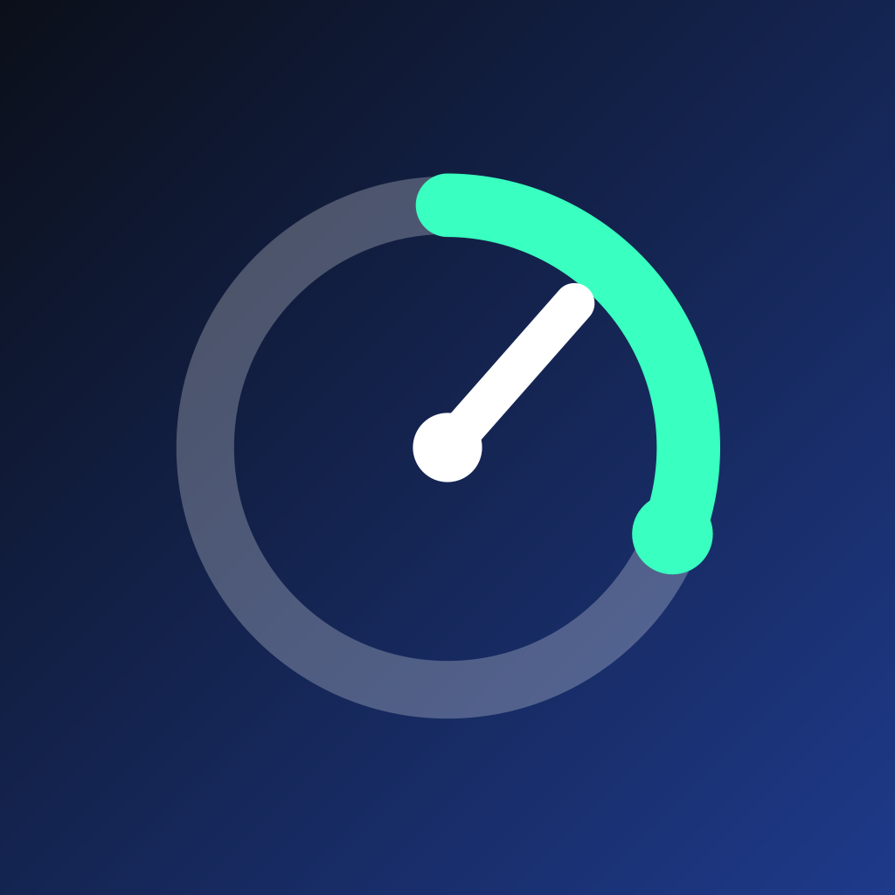
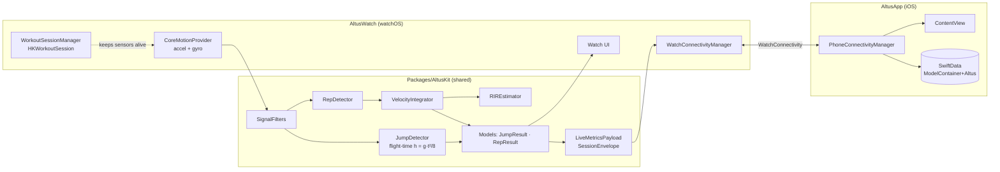
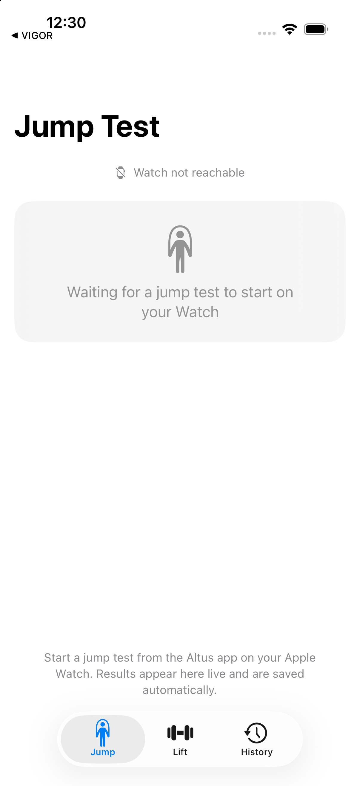
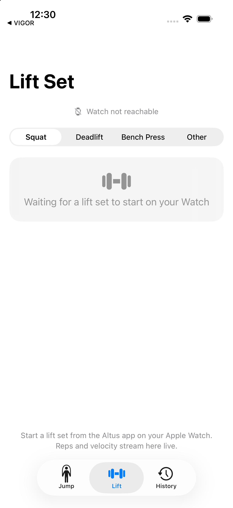
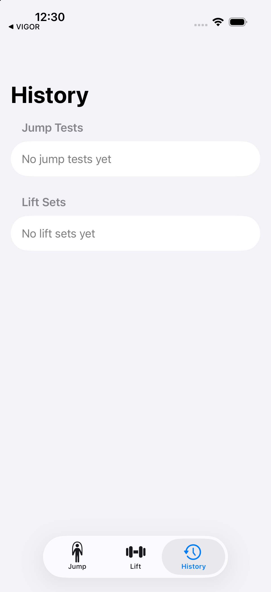
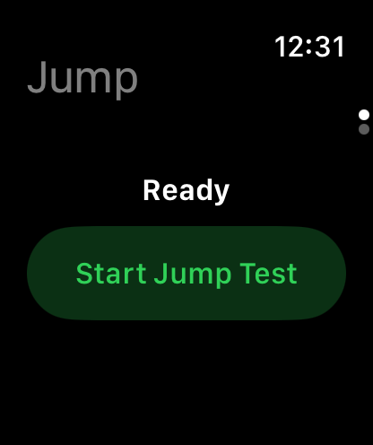
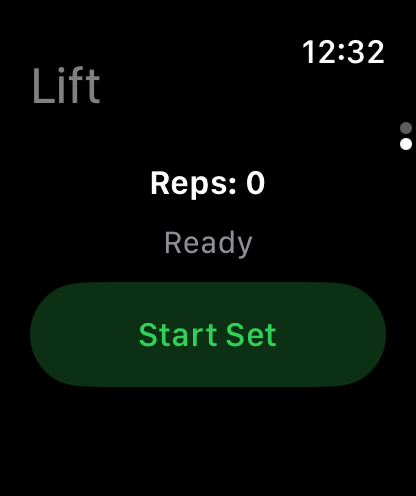

# Altus



Real-time vertical jump and velocity-based training (VBT) tracking, using only an iPhone and Apple Watch — no external hardware.

Altus turns the Watch's own accelerometer and gyroscope into a jump-height meter and a barbell-speed proxy, streaming live numbers to both devices at once while you train.


## Architecture



More detail: [docs/ARCHITECTURE.md](docs/ARCHITECTURE.md)

## What it does

**Jump testing.** Wear the Watch, jump, land. Altus times the flight phase and computes jump height with the standard flight-time method (`h = g·t²/8`), showing hang time and height live on the Watch and mirrored instantly on the iPhone.

**Velocity-based training (VBT).** During a lifting set, Altus segments the continuous motion signal into individual reps, computing mean concentric velocity and peak velocity per rep, tracking velocity loss across the set, and estimating reps-in-reserve (RIR) from that loss — the same principle behind dedicated VBT hardware like a PUSH Band or Beast Sensor, done entirely with the Watch's built-in sensors.

**Live on both screens at once.** Whichever device you're watching — wrist mid-lift, or phone propped nearby for a coach to see — shows the same numbers in real time.

| Jump Test (iPhone) | Lift Set (iPhone) | History (iPhone) |
|---|---|---|
|  |  |  |

| Jump Test (Watch) | Lift Set (Watch) |
|---|---|
|  |  |

## Framework and architecture

Altus is a native Xcode project with three build units, structured so the hard part — the sensor-fusion math — never touches a physical device or a UI framework:

```
Altus.xcodeproj (generated by xcodegen from project.yml)
├── AltusApp/            iOS app — SwiftUI + SwiftData
├── AltusWatch/           watchOS app — SwiftUI + CoreMotion + HealthKit
└── Packages/AltusKit/    Shared Swift package — pure Swift, zero platform imports
```

### AltusKit — the algorithm core

`AltusKit` has no dependency on CoreMotion, HealthKit, or WatchConnectivity. Every algorithm operates on a platform-neutral `MotionSample` struct, which means the entire sensor-fusion pipeline is unit-testable on macOS in milliseconds, with no simulator or device required:

- **`JumpDetector`** — a state machine (`armed → propulsion → flight → landed`) driven off raw accelerometer magnitude, keying off the classic freefall signature (accelerometer reads ~1g at rest, ~0g in freefall) to time the flight phase and derive jump height.
- **`RepDetector`** + **`VelocityIntegrator`** — projects acceleration onto the world-vertical axis, double-integrates it into velocity with zero-velocity updates (ZUPT) to bound drift, and segments the signal into discrete reps (`eccentric → bottom pause → concentric → lockout`), extracting mean concentric velocity, peak velocity, and velocity loss per rep.
- **`RIREstimator`** — maps velocity loss to an estimated reps-in-reserve via a configurable, per-exercise-tunable bucket table, explicitly surfaced as a heuristic rather than a precise measurement.
- **`LiveMetricsPayload` / `SessionEnvelope`** — the Codable message contract shared by both apps over WatchConnectivity.

```
Packages/AltusKit/Sources/AltusKit/
├── Sensing/       MotionSample, MotionSampleProviding (protocol — live sensor or test fixture)
├── Algorithms/    JumpDetector, RepDetector, VelocityIntegrator, RIREstimator, SignalFilters
├── Models/        ExerciseCategory, JumpMode, JumpResult, RepResult
└── Connectivity/  LiveMetricsPayload, SessionEnvelope
```

Covered by a passing XCTest suite (`swift test`) using synthetic and hand-derived motion fixtures — including a regression test that caught a real state-machine bug during development (the propulsion→flight transition was checking guard conditions in the wrong order).

### Real-time Watch ↔ iPhone sync

The Watch computes every metric locally and streams only the *derived* numbers — never raw sensor samples:

- **Live ticking updates** via `WCSession.sendMessage`, throttled to ~12 Hz but force-sent immediately on phase transitions (takeoff, landing, rep completed), so the UI feels responsive without flooding the link.
- **Final results** via `transferUserInfo`, a guaranteed/queued channel — a completed jump or set is never lost even if the live channel drops mid-session.

### watchOS sensing

`HKWorkoutSession` + `HKLiveWorkoutBuilder` keep the Watch app alive and `CMMotionManager` sampling at 50 Hz in the background during a session — the same mechanism real workout apps use to survive the screen dimming or the wrist dropping.

### iOS persistence

SwiftData (`Exercise`, `JumpTest`, `LiftSet`, `Rep`) is the single source of truth, living only on the phone — the Watch never persists locally, avoiding any need to reconcile two data stores. History includes a Swift Charts trend line for jump height over time.

## Capabilities at a glance

- Flight-time vertical jump measurement with hang time, height, and an arm-swing confidence signal (via gyroscope rotation-rate gating)
- VBT rep segmentation, mean concentric velocity, peak velocity, and velocity-loss tracking
- Configurable, per-exercise RIR estimation
- Dual-device real-time display (Watch + iPhone simultaneously)
- Background sensor capture via HealthKit workout sessions
- Local history with SwiftData + Swift Charts
- Platform-agnostic algorithm core with a synthetic-fixture unit test suite (no device required to iterate on the math)

## Tech stack

Swift · SwiftUI · SwiftData · Swift Charts · CoreMotion · HealthKit (`HKWorkoutSession`) · WatchConnectivity · [XcodeGen](https://github.com/yonaskolb/XcodeGen) · XCTest

## Getting started

```bash
# Generate the Xcode project from project.yml
xcodegen generate

# Run the algorithm test suite (no simulator needed)
cd Packages/AltusKit && swift test

# Open in Xcode
open Altus.xcodeproj
```

Build the `AltusApp` scheme for iOS and `AltusWatch` for watchOS. Both build and run in Simulator; running on physical hardware additionally needs a HealthKit capability added in Signing & Capabilities.

## Status

This is an early build. The jump-test flow (capture → live dual-device display → save → history) and the VBT flow (rep detection → velocity/RIR → save) are both wired end to end, but detector thresholds are physics-reasonable defaults, not yet tuned against real wrist-accelerometer data from a physical Watch. Running/sprint tracking is a planned future module — the sensing and connectivity layers were deliberately kept generic enough to add it without reworking the jump/VBT code paths.
