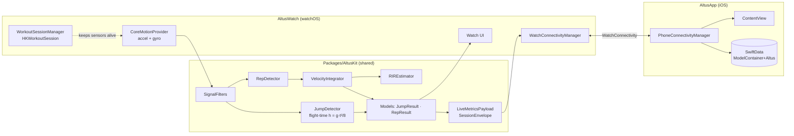

# Architecture

Apple Watch senses motion and runs the algorithms; the iPhone mirrors live numbers and stores history. Shared logic lives in the `AltusKit` Swift package.

Project generation is via XcodeGen (`project.yml`).
